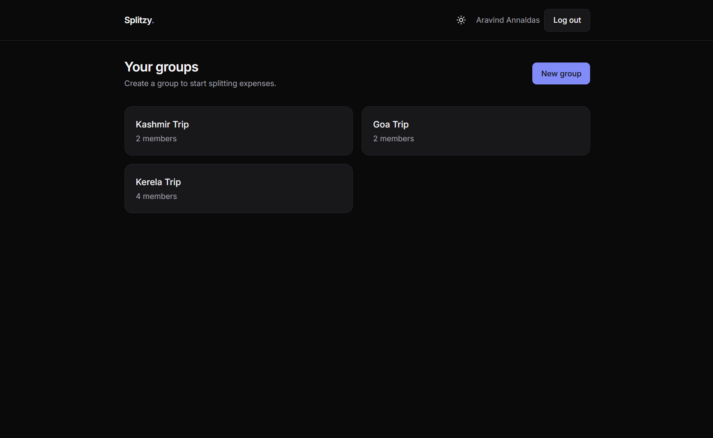
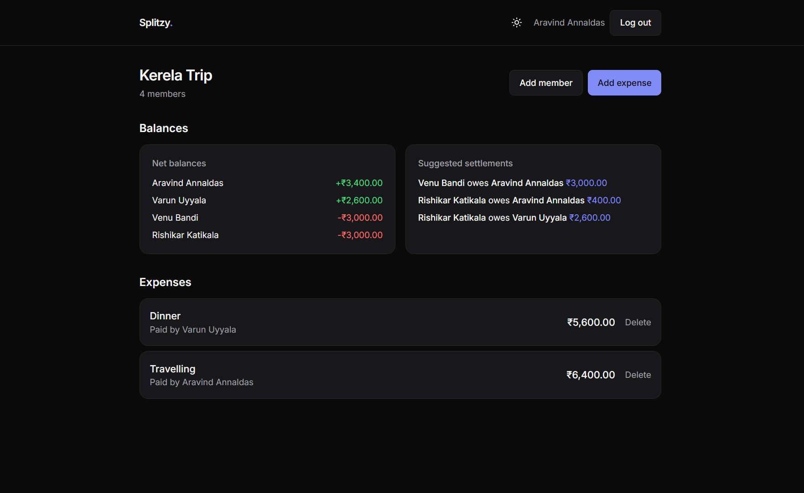

# Splitzy

A small expense-splitting app: create groups, log shared expenses, and see
who owes whom — settled with the fewest possible transactions.

**Live demo:** [splitzy-expense-tracker.vercel.app](https://splitzy-expense-tracker.vercel.app/)
**API:** `https://splitzy-api.up.railway.app`

> The deployed instance starts with an empty database — register a new
> account to try it out, or seed it first (see
> [Seeding a remote database](#seeding-a-remote-database)).

**Screenshots:**

| Dashboard | Group detail |
| --- | --- |
|  |  |

---

## Stack

- **Client:** Next.js 14 (App Router), TypeScript, Tailwind CSS, React Query
- **Server:** Node.js, Express, TypeScript, Prisma ORM 7 (driver adapters), PostgreSQL
- **Auth:** JWT + bcrypt
- **Hosting:** Vercel (client) + Railway (server + Postgres)

## Project structure

```
expense-splitter/
  client/   # Next.js app
  server/   # Express API + Prisma schema
```

---

## Setup

### Prerequisites

- Node.js 18+
- A PostgreSQL database (local install, or a free instance from
  [Neon](https://neon.tech) / [Supabase](https://supabase.com) / Railway)

### 1. Server

```bash
cd server
npm install
cp .env.example .env
# edit .env: set DATABASE_URL to your Postgres connection string,
# and JWT_SECRET to a long random string

npx prisma migrate dev --name init   # creates tables
npm run seed                         # optional: sample users + a group
npm run dev                          # starts on http://localhost:4000
```

Prisma 7 reads connection info from `server/prisma.config.ts` (via `@prisma/adapter-pg`) rather than from a `url` in `schema.prisma` — both the CLI and the running app pull `DATABASE_URL` from the same `.env`, so there's nothing extra to configure beyond setting that one variable.

Seeded accounts (if you run `npm run seed`): `alice@example.com`,
`bob@example.com`, `carol@example.com`, all with password `password123`.

### 2. Client

```bash
cd client
npm install
cp .env.local.example .env.local   # NEXT_PUBLIC_API_URL, defaults to localhost:4000
npm run dev                        # starts on http://localhost:3000
```

Open `http://localhost:3000`, register an account (or log in with a seeded
one), create a group, and add an expense.

### Seeding a remote database

Running `npm run seed` uses whatever `DATABASE_URL` is in your local `.env`
— to seed a database hosted elsewhere (e.g. Railway), point it there
instead, temporarily, without touching your `.env` file:

```bash
cd server
DATABASE_URL="<remote-connection-string>" npm run seed
```

On Railway specifically: your service's own `DATABASE_URL` variable uses
the internal hostname `postgres.railway.internal`, which only resolves
*inside* Railway's network — it won't connect from your laptop. Use
**`DATABASE_PUBLIC_URL`** instead (found on the Postgres service's
**Variables** tab), which is reachable from anywhere.

### Deploying

**Server — Railway** (or any host that supports a long-running Node process,
e.g. Render, Fly.io):

1. Push this repo to GitHub and create a new Railway project from it.
2. This is a monorepo, so set the service's **Root Directory** to `server`
   — otherwise Railway's build tool can't tell which app to build.
3. Add a **PostgreSQL** database to the same project (Railway → *+ New →
   Database → PostgreSQL*), then set `DATABASE_URL` on the server service to
   reference it.
4. Set the remaining env vars: `JWT_SECRET`, `CLIENT_ORIGIN` (your deployed
   client URL), `COOKIE_SECURE=true` (required — see note below), and
   `PORT` (match whatever port your Networking/domain settings forward to —
   Railway doesn't always inject this automatically, so set it explicitly,
   e.g. `8080`).
5. Build command: `npm install && npx prisma generate && npm run build`
   Start command: `npx prisma migrate deploy && npm start`
6. Generate a public domain under the service's **Settings → Networking**
   (e.g. `splitzy-api.up.railway.app`). Verify with:
   `curl https://splitzy-api.up.railway.app/health` → `{"ok":true}`.

**Client — Vercel:**

1. Import the same repo, set **Root Directory** to `client` (same monorepo
   reasoning as above).
2. Add env var `API_PROXY_TARGET` = your Railway server's public URL (e.g.
   `https://splitzy-api.up.railway.app`). **Do not** set
   `NEXT_PUBLIC_API_URL` in production — see the note below on why.
3. Deploy. Then go back to Railway and set `CLIENT_ORIGIN` to the resulting
   Vercel URL.

### Why API calls are proxied through the client's own domain

The client and server are deployed on different domains (`*.vercel.app`
and `*.railway.app`). Early on, the client called the API directly
cross-domain — this worked in desktop Chrome, but **broke silently on
Safari/iOS**: Safari's cross-site tracking prevention drops cookies set by
a different registrable domain than the page you're on, regardless of
`SameSite`/`Secure` attributes. Symptom: login appears to succeed, the
groups list shows empty, and refreshing bounces you back to `/login` —
because the auth cookies were never actually stored.

The fix (`client/next.config.mjs`) proxies every `/api/*` request through
the client's own origin to the real backend, server-to-server. From the
browser's point of view it's now a same-origin request, so the cookies it
gets back are first-party and Safari has no reason to block them. This is
why production sets `API_PROXY_TARGET` (server-side only, used by the
rewrite) instead of `NEXT_PUBLIC_API_URL` (which would make the browser
call the Railway domain directly again). Locally, client and server are
both `localhost` — already "same site" — so local dev skips the proxy and
calls `http://localhost:4000` directly via `NEXT_PUBLIC_API_URL`.

---

## Data model

```
User ──< GroupMember >── Group ──< Expense ──< ExpenseShare
                                     ↑              │
                                     └── paidById ───┘ (references GroupMember)
```

- **User** — an account (email + bcrypt password hash).
- **Group** — e.g. "Goa Trip". Has many members and many expenses.
- **GroupMember** — the join row between `User` and `Group`. Modeled as an
  explicit join table (not a raw many-to-many) because every piece of money
  logic — who paid, who owes — is scoped to *this user, in this group*, not
  to the user globally. A user has an independent balance in every group
  they're part of, and keying expenses/shares off `GroupMember` rather than
  `User` makes that scoping automatic instead of something every query has
  to re-derive.
- **Expense** — one shared cost: `description`, `amount` (integer paise, to
  avoid floating point rounding), `groupId`, and `paidById` (the
  `GroupMember` who fronted the money).
- **ExpenseShare** — one row per participating member per expense, storing
  how much of that expense they owe. An equal split of ₹100 among 3 people
  produces 3 `ExpenseShare` rows. The payer also gets a share (they consumed
  part of what they paid for) — see "Balance calculation" below for why that
  falls out naturally rather than needing special-case code.
- **Settlement** — an optional record of a real-world payment ("Bob paid
  Alice ₹500 in cash") that nets against the computed balance. This is
  different from the *suggested* settlement list the balance endpoint
  returns — that suggestion is never stored, only computed on demand.

Full schema with inline rationale: [`server/prisma/schema.prisma`](server/prisma/schema.prisma).

### Equal-split rounding

Amounts are integers (paise), so `amount / N` isn't always exact — ₹100
split 3 ways is 33.33 paise each. We take `base = floor(amount / N)` for
everyone, then give the leftover remainder (always `< N` paise) entirely to
the **payer's** share. The payer is already a fixed, meaningful identity in
the expense, so putting the odd cent there is simple to explain and fully
deterministic — "if it doesn't divide evenly, the payer keeps the extra
cent" — rather than depending on the arbitrary order members happened to be
sent in.

---

## The balance calculation

For every member of a group:

```
net = (total they paid across all expenses)
    − (total of their ExpenseShare amounts across all expenses)
    + (settlements they paid) − (settlements they received)
```

- **Positive net** → they're owed money.
- **Negative net** → they owe money.

This is computed **live** from the `Expense`, `ExpenseShare`, and
`Settlement` tables on every request (`GET /api/groups/:id/balances`) — there
is no cached running-total column anywhere. That's deliberate: if an expense
is edited or deleted, the very next read reflects it correctly, with nothing
that could drift out of sync.

**Why the payer's own share falls out for free:** we never write
special-case code for "the payer also owes their portion." We just sum two
independent things — money paid, and money owed via shares — per member, and
subtract. If Alice pays ₹300 for dinner split 3 ways, she gets `+300` from
the paid-total and `−100` from her own share, netting `+200` — exactly what
she's owed by the other two. No conditional logic needed; it's a property of
subtracting the two sums.

**Invariant:** the net balances across a group must always sum to zero,
because every rupee counted as "paid" by one member is counted as "owed"
by shares that always sum back to the expense's total, and every settlement
is a zero-sum transfer between two members. `computeGroupBalances` asserts
this before returning — if it ever throws, it means a data-integrity bug
(most likely a share written outside the create-expense transaction).

See [`server/src/utils/balance.ts`](server/src/utils/balance.ts) for the
implementation.

## Settlement simplification (the "who pays whom" algorithm)

Raw net balances tell you who's up and who's down, but naively you'd need
this many transactions to settle it: every debtor pays every creditor a
little bit. The greedy algorithm below finds the *minimum* number of
transactions instead.

**Steps:**

1. Split members into **debtors** (negative net — they owe) and
   **creditors** (positive net — they're owed). Anyone at exactly zero is
   already settled and is skipped.
2. Sort debtors by amount owed, descending, and creditors by amount owed
   *to* them, descending — biggest imbalances first.
3. Repeatedly take the current biggest debtor and biggest creditor. Settle
   `min(debtor's remaining debt, creditor's remaining credit)` between them
   — the smaller of the two, since that's the most either side can give or
   receive right now.
4. Subtract the settled amount from both sides. Whoever hits exactly zero
   drops out; the other carries their remaining balance forward against the
   next person in the opposite pile.
5. Repeat until both piles are empty.

**Why this minimizes transactions:** every step fully zeroes out at least
one person (whichever side had the smaller remaining amount). Zeroing out a
person removes them from all future consideration, so with N people who
have a nonzero balance, you never need more than N−1 transactions — the
last person left is guaranteed to net to exactly zero, by the invariant that
all balances sum to zero. Greedily matching the largest debtor against the
largest creditor is what actually achieves that bound, rather than some
arbitrary pairing that might leave small leftover balances scattered across
many people.

See `simplifySettlements` in
[`server/src/utils/balance.ts`](server/src/utils/balance.ts).

---

## API overview

| Method | Path | Description |
| --- | --- | --- |
| POST | `/api/auth/register` | Create an account, returns a JWT |
| POST | `/api/auth/login` | Log in, returns a JWT |
| GET | `/api/auth/me` | Current user (requires auth) |
| GET | `/api/groups` | Groups the current user belongs to |
| POST | `/api/groups` | Create a group (creator becomes first member) |
| GET | `/api/groups/:id` | Group detail, members, expenses |
| POST | `/api/groups/:id/members` | Add a member by email |
| DELETE | `/api/groups/:id` | Delete a group |
| GET | `/api/groups/:id/balances` | Net balances + suggested settlements |
| POST | `/api/expenses` | Create an expense (transactional, with shares) |
| GET | `/api/expenses/:id` | Expense detail |
| DELETE | `/api/expenses/:id` | Delete an expense |

All routes except register/login require `Authorization: Bearer <token>`.

## Auth flow

1. Register/login hashes (bcrypt) or verifies the password, then signs a JWT
   containing `{ userId }`.
2. The client stores the token (`localStorage`) and sends it as
   `Authorization: Bearer <token>` on every request.
3. `requireAuth` middleware verifies the signature and expiry on every
   protected route; invalid or expired tokens get a `401`, never a silent
   pass-through.

## Why expense creation is transactional

Creating an expense means writing one `Expense` row and N `ExpenseShare`
rows. If those writes weren't atomic and the process died between them,
you'd end up with a payer who "paid" the full amount but shares that don't
sum to it — the balance calculation would then produce numbers that look
plausible but are wrong, with no error to signal it. `prisma.$transaction`
makes it all-or-nothing: either the expense and every one of its shares
exist, or none of it does.

---

## Testing the invariant

`computeGroupBalances` throws if a group's net balances don't sum to zero.
A quick manual check after seeding: hit `GET /api/groups/:id/balances` for
the seeded "Goa Trip" group and confirm the three members' `net` values add
up to `0`.
